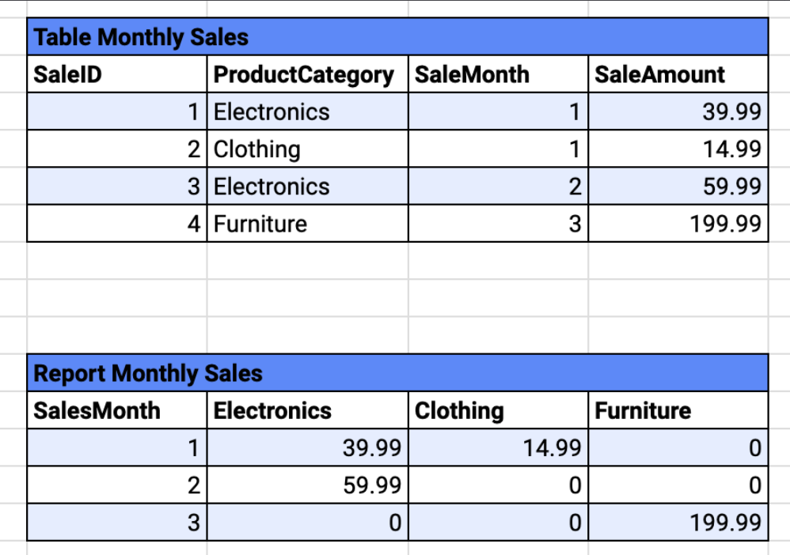
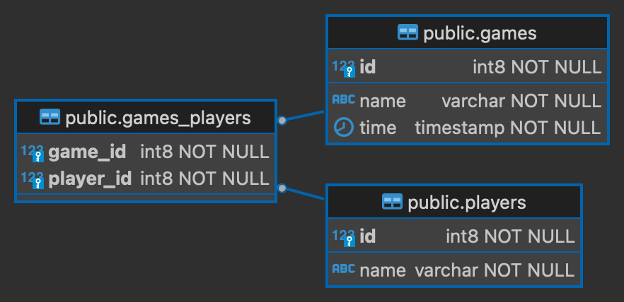

### Data Engineering Fundamentals

1. A Data Engineer is tasked with creating a report on an Amazon RDS instance to support a customer loyalty analysis. The database contains two tables: Customers (listing all registered customers) and Orders (recording customer purchases). The report should retrieve all customers' information along with their order details if they have placed any orders. Which SQL query ensures that every customer is included, and orders are shown only if they exist?

        SELECT * FROM Customers LEFT JOIN Orders On Customers.CusteomerID = Orders.CustomerID

2. A Data Engineer discovers a critical bug in the production data transformation pipeline managed in a Git repository on the `master` branch. To comply with the company's policy of using feature branches for bug fixes and enhancements, which sequence of Git commands should the engineer use to set up their development environment to address this issue?

    a. git clone flollwed by git checkout -b
    b. git pull followed by git branch -b

    Answer: a. 
    the git clone command is used to make a local copy of the specified repository. Following this, the git checkout -b command creates a new branch and switches to it immediately. 
    This sequence is appropriate for starting work on a new branch, such as a hotfix branch
    (修補程序分支),directly after cloning a repository.

3. Data Engineer is using AWS Redshift to analyze sales data from a retail company. The table, `Monthly_Sales`, includes columns for `SaleID`, `ProductCategory`, `SaleMonth`, and `SaleAmount`. The task is to generate a monthly sales report, where each product category (Electronics, Clothing, Furniture) is **displayed as a column header** and each row represents a month with the total sales for that category. Which SQL operation should be used in AWS Redshift to efficiently generate the report according to the requirement?

    

    a. GROUP BY
    b. PIVOT

    Ansewr: b.

    題的關鍵在於「要把列變欄」，不是單純統計各分類金額，而是要顯示成報表格式 → 因此是 PIVOT。

4. A Data Engineer at a healthcare organization is tasked with analyzing patient satisfaction across various departments to identify areas for improvement. The patient population is diverse, with significant variations in age, treatment types, and outcomes. To ensure that the analysis is comprehensive and accounts for the diverse characteristics of the patient groups, the engineer must choose an appropriate method for sampling the data from the hospital's patient records database. What technique should the engineer use to accurately reflect the different segments of the patient population in the analysis?

    a. Random Sampling
    b. Stratified Sampling (分層)

    Answer: b.

5. A data engineering team is using Apache Spark to process a large dataset comprising user activity logs. The dataset is distributed across multiple nodes in a Spark cluster. During the processing, the team notices that **some tasks are taking significantly longer to complete than others**, causing delays in the overall processing time. Additionally, they observe that certain nodes in the cluster are consistently under heavier load compared to others.

    a. The data is configured with a low number of partitions
    b. There is a data skew in the input dataset

    Answer: b

    為什麼某些 Spark 任務耗時顯著更久，而某些節點的 負載特別重，導致整體處理延遲？

    a. The data is configured with a low number of partitions
    少量 partitions 會導致 整體並行度降低，也就是節點數多但工作不夠分，造成閒置。

    這通常會讓大多數任務差不多耗時，只是**整體速度慢**，不會造成**部分任務特別慢或負載特別不均**。

    👉 所以 不是造成「部分節點明顯較慢或忙」的主要原因。

    b. There is a data skew in the input dataset
    **資料傾斜（data skew）是指某些 key（或值）在資料中出現的頻率遠高於其他 key。**

    在 Spark 中，像 groupBy, join, reduceByKey 等操作會根據 key 分區，這樣會導致：

    熱點 key 被分到特定 partition

    那個 partition 會包含 大量資料與計算工作

    造成某些 task 明顯比其他 task 慢（而不是所有 task 一樣慢）

    **某些 worker 節點負載重，其餘節點相對輕鬆 → 資源使用不均**

    👉 這正是題目描述的現象。

6. A Data Engineer is tasked with developing a scalable data processing solution using AWS services to analyze game participation data. The solution needs to leverage data stored in three PostgreSQL tables within an Amazon RDS instance, as depicted in the provided ERD. The `games` table includes fields for `id`, `name`, and `time`, and the `players` table includes fields for `id`, and `name`, with table `games_players’ linking both the players and the games they participated in. Each player is allowed to participate once in a given game.

    
    
    Based on the ER diagram which constraint on `public.games_players` table is correct?

    CONSTRAINT fk_game FOREIGN KEY (game_id) REFERENCES public.games(id)

7. A product owner at a retail company intends to disable an existing data pipeline that aggregates sales data across various departments. Before proceeding, the product owner wants to understand the impact this action will have on downstream processes and reports that rely on this data. To assist in this analysis, which approach should the data engineering team implement?
   
    a. Create a backup of the existing data sets.
    b. Implement data lineage throughout the pipeline.

8. A product owner at a financial analytics company is looking to **reduce storage costs** and **enhance the performance of SQL queries** on their large datasets of transaction records. The datasets are currently stored in a traditional row-oriented format, which has led to increased storage needs and slower query response times. To address these concerns, which file format should the data engineering team transition their data storage to?

    a. Migrate the data to a more efficient relational database (X)
    b. Archive older data to cold storage (X)
    c. **Convert the datasets to a columnar storage format** (O)

    Answer: c

    a: Incorrect because **relational database aren't designed to ideally serve horizontally scalable data warehousing solutions**.
    Besides that this solution doesn't address the inherent problems stated in the question such as reducing costs or increasing performance.

    b: Incorrect as this choice primarily focuses on reducing costs by moving less frequently accessed data to cheaper storage solutions. However,it does not enhance the performance of quieres on the data that remains active. Additionally, this action **does not improve the efficiency of data retrieval or procession for the active datasets**, which was a key goal of the product owner.

    c: Converting the data to a columnar storage format such as Prquet, aligns perfectly with the goals of reducing storage costs and boosting query performance. Columnar formats store data by columns rather than rows, making them ideal for analytics and complex queries as only the necessary columns need to read and processed. This leads to faster retrieval times and significant reductions in storage space, especially when dealing with large datasets.

9. An insurance company is planning to launch a new product that will utilize diverse data sources, including data from transactional systems, customer emails, and weblogs. To support analytics and machine learning models that will help tailor and optimize this product, which data storage solution should the data engineering team choose?

    Answer: Store all logs, emails, and transactional data in data lake.

10. A data engineer at a digital marketing firm is tasked with integrating various data sources for advanced analytics. The company collects data from social media interactions, website logs, and customer feedback surveys. Given the nature of data originating from multiple sources, which of the following describes the data correctly?

    Answer: Semi-structured data

### Storage
1. You are an AWS architect at CloudTech Innovations. One of your clients, MyPhotos Inc., runs a photo-sharing platform where users upload millions of photos daily. To optimize storage costs, the client has the following requirements:

    Photos that are uploaded should be immediately accessible for fast retrieval for 30 days.

    After 30 days, the photos should be transitioned to a storage class that's cost-effective but still ensures fairly quick access.

    After 365 days, the photos are seldom accessed and should be moved to the most cost-effective archival storage.

    If a photo hasn't been accessed for 5 years, it should be deleted to ensure GDPR compliance.

    Which S3 lifecycle policy should you configure to meet the client's requirements?

    a. Transition objects to S3 Standard-IA after 30 days, transition to S3 Glacier after 365 days, and delete after 5 years. (O)

    

    b. Transition objects to S3 ~~Intelligent-Tiering~~ after 30 days, transition to S3 ~~Glacier Deep Archive~~ after 365 days, and delete after 5 years. (X)

    **S3 Intelligent-Tiering** after 30 days：
    智慧分層是設計來自動根據存取頻率優化成本，適合「**存取模式不可預測**」的資料，但我們已明確知道這些照片前 30 天會常被存取，30–365 天「較少」存取，過後「幾乎不存取」。這種情境下不需 Intelligent-Tiering 的自動化功能，反而浪費錢（有監控費用）。

    Glacier Deep Archive 適用於極少存取且可接受長時間恢復（最高 12 小時）。
    在題目中說「365 天後偶爾仍可能存取」，但 Deep Archive 回復時間長，不符合「fairly quick access」 的需求。應該選 Glacier，而非 Deep Archive。

    c. Transition objects to S3 ~~Intelligent-Tiering~~ after 30 days, transition to S3 Glacier after 1 year, and enable Object Expiration for objects older than 5 years. (X)

2. A data engineering team uses Amazon S3 to store critical configuration files for their applications. These configurations are updated frequently, and sometimes they need to roll back to previous versions due to unforeseen issues. To ensure they can retrieve previous versions of a file, which of the following actions should they take regarding S3?

    Answer: Enable S3 Versioning for the bucket.

3. A data engineering team in Company XYZ is utilizing Amazon S3 to store transaction logs. These logs are essential for both operational reporting and compliance. They have a primary bucket in the us-east-1 region. To ensure that they have a backup of this data in another geographical location and to provide low-latency access to their Asia-based analysts, which of the following steps should they take?

    a. Enable S3 Cros Region Replication (CRR) on the primary bucket and replicate the logs to a bucket in the ap-southeast-1 region. (O)

    Company XYZ 想達成兩個目標：
    ✅ 在不同地理區域建立備份（backup） — 為了資料備援與合規性。

    ✅ 讓亞洲分析人員能低延遲存取資料 — 提供接近分析使用者的資料存取點（低延遲）。

    S3 Cross-Region Replication (CRR)
    功能：CRR 可以自動地、非同步地將 S3 bucket 的資料從一個 AWS 區域（如 us-east-1）複製到另一個區域（如 ap-southeast-1）。

    優點：
    滿足 資料備援與災難復原需求（備份在不同區域）。
    亞洲分析師可以直接在 ap-southeast-1 區域的 bucket 上存取資料，實現低延遲。
    條件：來源 bucket 必須開啟版本控制（versioning），並設定目標 bucket 也在目標區域。

    📌 完全符合兩個需求 → 正確答案

    b. Set up Transfer Acceleration on the primary bucket and direct the Asia-based analysts to this accelerated endpoint.

    S3 Transfer Acceleration
    功能：透過 Amazon CloudFront 邊緣節點加速跨地區上傳/下載 S3 資料。

    優點：
    加快從全球任一地點對「單一 bucket」的資料傳輸速度。

    缺點：
    無法實現跨區域備援，因為資料仍只存在 us-east-1。
    雖然對亞洲分析師的資料下載會變快，但 並未真正將資料複製到亞洲區域，仍然是從美國讀取。

    📌 僅解決存取延遲，但不解決備份問題 → 不是最佳選擇

4. A data engineering team in Company ABC wants to create a data pipeline where new files uploaded to an S3 bucket trigger a Lambda function for processing. The processed data is then stored in a different S3 bucket. The goal is to simplify the creation and maintenance of this pipeline. Which of the following configurations will meet the team's requirements?

    a. Set up and S3 even notification on the source bucket to trigger the Lambda function when a new object is created. (O)
    This is the correct answer. S3 event notifications can be set up to notify and trigger other AWS services, like Lambda,
    upon specific events in the bucket, such as the creation of a new object.

    b. Use AWS Data Pipeline with a data node representing the source bucket and periodically poll for new files to trigger the Lambda function.

    AWS Data Pipeline can automate the movement and transformation of data. While it can poll an S3 bucket for new files, using it in this scenario introduces more complexity than necessary. 

5. Company DEF has a strict security policy that mandates that all data at rest in Amazon S3 must be encrypted. They want to ensure that the encryption keys are managed by AWS, but they also want the flexibility to change the encryption keys when required. Which of the following encryption methods best meets Company DEF's requirements?

    Answer: Server-Side Encryption with AWS Key Management Service (SSE-KMS)

    With AWS SSE-KMS, AWS key Management Service manages the encryption kes, but customer retain the ability to manage and change their own encryption keys using KMS.

6. An e-commerce company has large amounts of transaction data stored on-premises through an NFS file share. They want to leverage AWS Lambda to analyze this data while continuing to use the NFS system for data storage, ensuring that Lambda can concurrently access this data. Which of the following solutions will best meet the company's requirements?

    Answer: Use Amazon EFS to create a file system and synchronize data from the on-premises NFS. Then, configure the AWS Lambda funtion to access the EFS file system.

    Amazon EFS supports the Network File System version 4 (NFSv4) protocol, which allows for seamless integration with existing applications and workflows that reply on NFS. AWS Lambda can directly integrate withe Amazon EFS, providing concurrent access to the shared data

7. A company is designing a data lake on Amazon S3. To ensure high performance when accessing the data, which best practice should the company adopt in organizing its data in the S3 bucket?

    a. Use a flat structure by avoiding the creation of any prefix or "folder" hierarchy. (X)
    Using a flat structure without any prefix or "folder" hierarchy can lead to inefficiencies when trying to  access or manage the data. Organizing data with logical prefixes can help in improving the data access pattern.

    b. Partition data based on commonly accessed attributes and use a consistent naming schema for prefiex. (O)
    Partitioning data based on frequently accessed attributes (eg. date, region or prooduct type) and using a consistent naming scheme for prefixes allows efficient data retrieval and can redue the cost of queries.

    For example, for time-based queries, partitioning data by year, month, or day can make data retrieval much faster.

8. A company is using an Amazon S3 bucket to store sensitive data for its data engineering pipeline. The company's security team has mandated that all access to this data should originate only from within the company's VPC. Which action should the data engineering team take to ensure this security requirement is met?

    a. Enable VPC Endpoints for Amazon S3 and associate them with the company's VPC (X)
    Enabling VPC Endpoints for Amazon S3 for private connections between the VPC and S3 without travering the public internet. However, **merely enabling VPC Endpoints does not prevent access from outside the VPC by default**.

    Enable VPC Endpoints for Amazon S3
    ✅ 優點：
    VPC Endpoint（Gateway Endpoint for S3）可以讓 VPC 中的資源（如 EC2）私下連到 S3，不走公網。

    ❌ 但問題是：
    它只是開通一條私有通道，但不會阻擋其他來源（如公網 IP、其他帳號、其他 VPC）來存取該 bucket。

    如果沒有額外設定 bucket policy，其他來源依然可以透過 S3 public endpoint 存取該 bucket（如果有權限）。

    📌 僅解決私有連線，但無法阻擋非 VPC 存取 → 不符合題目要求。

    b. Update the S3 bucket policy to deny all requests that do not originate from the company's VPC. (O)
    By updating the S3 bucket policy to explicity deny requests that don't come from the company's VPC (using the aws:SourceVpce condition key), the data engineering team can enforce that access originates only from within the specified VPC.

    c. Use AWS KMS to encrypt the S3 bucket, ensuring only the company's VPC has the decryption key. (X)
    ✅ AWS KMS 加密資料可以控管「誰」可以解密資料。

    ❌ 但：
    KMS policies 無法限制「只能從特定 VPC 存取」解密。

    資料還是可以被下載（甚至從公網），只是可能無法解密而已。

    此方法無法阻擋存取路徑或來源，只是加密的補強。

    📌 KMS 是資料保護手段，不是網路存取控制手段 → 不符合題目要求。

9. In a data engineering pipeline, a company is using multiple applications and teams to access a shared Amazon S3 bucket. To streamline access and simplify permissions management for these different entities, which S3 feature should the company utilize?

    a. Enable multiple IAM roles, each corresponding to an application or team, granting access to the S3 bucket.
    IAM 的優點：
    IAM roles 可用來精細控制誰可以對資源進行什麼操作

    ❌ 缺點：
    當有多個團隊、應用都需存取同一個 S3 bucket，IAM policy 管理會變得複雜且難維護

    你必須在 IAM 中加入所有 bucket ARN 和具體操作，容易出錯、缺乏靈活性

    不提供獨立的端點，每個存取者都需知道完整 bucket 路徑與權限細節

    📌 適用於小規模或角色明確情境，不適合共享大型 S3 資料集 → 不是最佳解法

    b. Use S3 Access Points to create unique endpoints whith tailored permissions for each application or team. (O)
    Access Points offer simplified method to manage data access at scale for applications using shared data sets on S3.
    
    **Access Points 專為「共享 bucket，分組授權」的情境設計**
    每個 Access Point：
    有自己獨立的 endpoint
    有自己的 IAM policy
    可限定對 bucket 中特定 prefix 的存取

    ✅ 優點：
    簡化權限管理與資源隔離（每組/應用一個 Access Point）
    支援高可用與安全控管（配合 VPC、限制 IP、限制操作等）
    可搭配 VPC Access Points 實現私有網路專用存取

    📌 正是題目需求的官方推薦方案

10. A data engineering pipeline leverages multiple AWS resources, including Amazon RDS, Amazon EFS, and Amazon DynamoDB. The company wants a centralized backup solution that offers consistent backup and restore capabilities across these services. Which AWS service should the company use to meet this requirement?

    Answer: Use AWS Backup to centrally manage backups across the metioned AWS resources.

11. An online gaming application has a large chunk of its traffic coming from users who download static assets such as historic leaderboard reports and the game tactics for various games. The current infrastructure and design are unable to handle the traffic and application freezes on most of the pages.

    Which of the following is a cost-optimal solution that requires the LEAST operational overhead?

    a. Use Amazon CloudFront with Amazon S3 as the storage solution for the static assets. (O)

    When you put your content in an Amazon S3 bucket in the cloud, a lot of things become much easier. First, you don’t need to plan for and allocate a specific amount of storage space because Amazon S3 buckets scale automatically. As Amazon S3 is a serverless service, you don’t need to manage or patch servers that store files yourself; you just put and get your content. Finally, even if you require a server for your application (for example, because you have a dynamic application), the server can be smaller because it doesn’t have to handle requests for static content.

    Amazon CloudFront is a content delivery network (CDN) service that delivers static and dynamic web content, video streams, and APIs around the world, securely and at scale. By design, delivering data out of Amazon CloudFront can be more cost-effective than delivering it from Amazon S3 directly to your users. Amazon CloudFront serves content through a worldwide network of data centers called Edge Locations. Using edge servers to cache and serve content improves performance by providing content closer to where viewers are located.

    When a user requests content that you serve with Amazon CloudFront, their request is routed to a nearby Edge Location. If Amazon CloudFront has a cached copy of the requested file, CloudFront delivers it to the user, providing a fast (low-latency) response. If the file they’ve requested isn’t yet cached, CloudFront retrieves it from your origin – for example, the Amazon S3 bucket where you’ve stored your content. Then, for the next local request for the same content, it’s already cached nearby and can be served immediately.

    By caching your content in Edge Locations, Amazon CloudFront reduces the load on your Amazon S3 bucket and helps ensure a faster response for your users when they request content. Also, data transfer out for content by using Amazon CloudFront is often more cost-effective than serving files directly from Amazon S3, and there is no data transfer fee from Amazon S3 to Amazon CloudFront. You only pay for what is delivered to the internet from Amazon CloudFront, plus request fees.

    b. Configure AMS Lambda with and Amazon RDS database to provide a serverless architecture. (X)

    Amazon RDS is not the right choice for the given scenario because of the overhead of a database management system, as the given use-case can be addressed by using the Amazon S3 storage solution.
    (存儲的大多是圖片這種item, 放在S3較洽當 跟RDS無關)

    

12. A data engineering team has deployed a microservice to the Amazon Elastic Container Service (Amazon ECS). The application layer is in a Docker container that provides both static and dynamic content through an Application Load Balancer. With increasing load, the Amazon ECS cluster is experiencing higher network usage. The team has looked into the network usage and found that 90% of it is due to distributing static content of the application.

    What do you recommend to improve the application's network usage and decrease costs?

    a. Distribute the static content through Amazon S3 (O)
    b. Distribute the static content through EFS (X)
    c. Distribute the dynamic content through EFS (X)
    
    b. & c: See Storage-EC2 Instance Storage Section-EFS (Elastic File System)

    Amazon Elastic File System (Amazon EFS) provides a simple, scalable, fully managed elastic NFS file system for use with AWS Cloud services and on-premises resources. **Using Amazon EFS for static or dynamic content will not change anything as static content on EFS would still have to be distributed by the Amazon ECS instances.**

    Amazon EFS（Elastic File System） 是一種用於 EC2 和 ECS 等服務的 **網路附加儲存（NFS） 解決方案**。
    如果你把靜態內容（如 HTML、CSS、JS、圖片）放在 EFS 上，ECS 容器**還是必須經由網路從 EFS 讀取這些檔案，再透過 Application Load Balancer 傳送給用戶端**。
    這種方式 無法減少 ECS 的網路流量或成本，反而可能增加延遲與負擔，因為流量還是流經 ECS。

    此外，EFS 並不會「分發」動態內容，它只是儲存資料的地方，像是上傳的檔案或暫存資料。
    如果你把動態內容「儲存在」EFS 上，ECS 還是需要經由網路去讀取/寫入這些資料，這不會減少 ECS 網路負載，反而可能讓回應時間變慢。
    再者，「動態內容」應該由後端服務產生，不適合靠 EFS 這種儲存系統來「分發」。
    
    References:

    https://docs.aws.amazon.com/AmazonS3/latest/dev/WebsiteHosting.html

13. A company makes use of multiple AWS Lambda functions for implementing various business requirements. These Lambda functions use code from common custom Python scripts that are also maintained by a data engineer along with the Lambda functions. The data engineer is looking for a solution to reduce the operational/maintenance work of updating the code in the Lambda functions when a change has to be made in the scripts.

    What is the most efficient way of implementing this change ?

    Answer: Package the custom Python scripts into Lambda layers. Apply the Lambda layers to all the AWS Lambda functions using the scripts.

    A Lambda layer is a .zip file archive that contains supplementary code or data. Layers usually contain library dependencies, a custom runtime, or configuration files. There are multiple reasons why you might consider using layers: To reduce the size of your deployment packages, To separate core function logic from dependencies, To share dependencies across multiple functions, and To use the Lambda console code editor.

    You can include up to five layers per function. Also, you can use layers only with Lambda functions deployed as a .zip file archive. For functions defined as a container image, package your preferred runtime and all code dependencies when you create the container image.

    Working with Lambda layers:

    

14. The IT department at a company is conducting a training workshop for new data engineers. As part of an evaluation exercise on Amazon S3, the new data engineers were asked to identify the invalid storage class lifecycle transitions for objects stored on Amazon S3.

    Can you identify the **INVALID** lifecycle transitions from the options below? (Select two) ?

    a. Amazon S3 Standard-IA => Amazon S3 Intelligent-Tiering (O)
    b. Amazon S3 Intelligent-Tiering => Amazon S3 Standard (X)
    c. Amazon S3 One Zone-IA=> Amazon S3 Standard (X)
    d. Amazon S3 Standard => Amazon S3 Intelligent-Tiering (O)
    e. Amazon S3 Standard-IA => Amazon S3 One Zone-IA (O)

    Answer: b & c

    Here are the supported life cycle transitions for S3 storage classes - The S3 Standard storage class to any other storage class. Any storage class to the S3 Glacier or S3 Glacier Deep Archive storage classes. The S3 Standard-IA storage class to the S3 Intelligent-Tiering or S3 One Zone-IA storage classes. The S3 Intelligent-Tiering storage class to the S3 One Zone-IA storage class. The S3 Glacier storage class to the S3 Glacier Deep Archive storage class.

    Amazon S3 supports a waterfall model for transitioning between storage classes, as shown in the diagram below:

        

    S3 Standard => S3 Standard-IA => S3 Intelligent-Tiering => S3 One Zone-IA => S3 Glacier Instant Retrieval => S3 Glacier Flexible Retrieval => S3 Glacier Deep Archive

    Reference:

    https://docs.aws.amazon.com/AmazonS3/latest/dev/lifecycle-transition-general-considerations.html

### Database
1. (See DynamoDB – Partitions Internal) 

    To compute the number of partitions:
    
    • # 𝑜𝑓 𝑝𝑎𝑟𝑡𝑖𝑡𝑖𝑜𝑛𝑠𝑏𝑦 𝑐𝑎𝑝𝑎𝑐𝑖𝑡𝑦= 
    \(\left( \frac{RCUS_{Total}}{3000} \right) + \left( \frac{WCUS_{Total}}{1000} \right)\)

    • # 𝑜𝑓 𝑝𝑎𝑟𝑡𝑖𝑡𝑖𝑜𝑛𝑠𝑏𝑦 𝑠𝑖𝑧𝑒=𝑇𝑜𝑡𝑎𝑙 𝑆𝑖𝑧𝑒
    \(\frac {𝑇𝑜𝑡𝑎𝑙 𝑆𝑖𝑧𝑒}{10 GB}\)

    • # 𝑜𝑓 𝑝𝑎𝑟𝑡𝑖𝑡𝑖𝑜𝑛𝑠=
    ceil(max# 𝑜𝑓 𝑝𝑎𝑟𝑡𝑖𝑡𝑖𝑜𝑛𝑠𝑏𝑦 𝑐𝑎𝑝𝑎𝑐𝑖𝑡𝑦,# 𝑜𝑓 𝑝𝑎𝑟𝑡𝑖𝑡𝑖𝑜𝑛𝑠𝑏𝑦 𝑠𝑖𝑧𝑒 )

    1) 你有一個 DynamoDB table，總資料大小為 40 GB，設定為：

        RCU: 6000
        WCU: 3000

        請問這個 table 需要至少幾個 partitions？

        ✅ 解答：
        
        a. 依容量：

            RCU/3000 = 6000/3000 = 2
            WCU/1000 = 3000/1000 = 3
            總partitions by capacity = 2+3=5

        b. 依大小:

            40GB/10GB = 4

        c. 取最大值，向上取整:

            max(5,4) =5 => 需要5 partitions
        

    2) 你有一個 DynamoDB table，總資料大小為 25 GB，設定為：

        RCU: 2000
        WCU: 500

        請問最少需要幾個 partitions？

        ✅ 解答：
        
        a. 依容量： 
            
            RCU/3000 = 2000/3000 ≒ 0.67
            WCU/1000 = 500/1000 ≒ 0.5
            總partitions by capacity = 0.67+0.5=1.17 => ceil=2

         b. 依大小:

            25GB/10GB = 2.5=> ceil=3

        c. 取最大值，向上取整:

            max(2,3) =3 => 需要3 partitions       

    3) 觀念題）： 哪一個是 partition 計算的正確邏輯？

        A. 只根據 RCU/WCU 計算
        B. 只根據總資料大小計算
        C. 根據 RCU/WCU 和資料大小中較大的那個來決定
        D. RCUs + WCUs + item 數量

        ✅ 解答：C
        DynamoDB 的 partition 是根據 容量和大小中較大的需求 來決定。

2. A data engineer is provisioning a DynamoDB table for an e-commerce application. The engineer is planning to allocate 500 Write Capacity Units, 5000 Read Capacity Units, and 50GB of space for this table.

    How many partitions will be created in the table for this requirement?

    Answer:5 Partitions

    Partitions by capacity: Roundup[(500WCU/1000WCU) + (5000RCU/3000RCU)] = 3 partitions
    Partitions by size: 50GB/10GB=5 partitions
    max(3,5) = 5 partitions

2. A developer notices that their application is frequently receiving ProvisionedThroughputExceededException errors when interacting with a DynamoDB table. What could be a potential cause for these errors?

    a. The DynamoDB table has reached its maimum storage limit.(X)
    DynamoDB is managed service that automatically scales storage, and tables do not have a maximum storage limit. Hence, reaching a storage limit isn't a cause for ProvisionedThrooughputExceededException.
    
    b. The application's requests are exceeding the provisoned read capacity units (RCU) or write capacity units (WCU) for the table. (O)

3. A developer is designing a DynamoDB table for an application that tracks user comments on various articles. Each user can comment on multiple articles. The primary key of the table uses UserID as the partition key and CommentID as the sort key. To efficiently retrieve all comments for a specific article, which optimization should the developer apply?

    a. Create a Global Secondary Index(GSI) with ArticleID as the partition key. (O)
    This is the correct answer. Creating a GSI with ArticleID as the partition key allows for efficient retrieval of all comments for a specific article, irrespective of the user.

    b. Create a Local Secondary Index(LSI) with AritcalID as the partition key. (X)
    c. Add an additional attribute ArticleID to the primary key of the table. (X)

    當設計 DynamoDB 資料表用來追蹤使用者對文章的評論時，若主鍵使用 UserID 作為 partition key、CommentID 作為 sort key，則這樣的設計有利於根據「使用者」查詢其所有評論。但若想要依照文章（ArticleID）查詢所有相關評論，這個設計就不夠有效率。因此要進行優化。
    所以a. Create a Global Secondary Index (GSI) with ArticleID as the partition key.
    
    說明：
    建立 GSI，並以 ArticleID 作為 partition key，這是解決此需求的最佳方式。因為：
    - **GSI 允許使用不同於主鍵的方式來查詢資料**。
    - 以 ArticleID 作為 GSI 的 partition key，可以讓我們有效率地查詢某篇文章底下的所有評論（不論是誰發的）。
    - **可以加入其他欄位作為 GSI 的 sort key，例如 CommentID 或 Timestamp**，以提供更進階的排序或查詢能力。

    為何是正確答案：
    這可以有效實現「快速查詢某篇文章所有評論」的需求，完全解耦主鍵中 UserID 的限制。

    ❌ b. Create a Local Secondary Index (LSI) with ArticleID as the partition key.
    說明：
    **LSI 必須使用與主鍵相同的 partition key**（也就是 UserID），僅能更換 sort key，因此不能將 ArticleID 當作 partition key 使用。

    為何是錯誤答案：
    你無法用 LSI 改變 partition key，所以無法實現跨使用者查詢同一篇文章評論的需求。

    ❌ c. Add an additional attribute ArticleID to the primary key of the table.
    說明：
    你不能在 DynamoDB 的主鍵中加入第三個欄位（DynamoDB primary key 只能由 partition key 和 sort key 組成）。

    你可以把 ArticleID 包含在 sort key 中（例如複合 key CommentID#ArticleID），但這會導致查詢複雜、效率不高，而且仍舊受到 partition key（UserID）的限制。

    為何是錯誤答案：
    這不會幫助你以 ArticleID 為基礎來查詢評論，因為查詢仍被限制於 UserID 分區內。

4. An e-commerce application frequently reads popular product details from a DynamoDB table, causing **occasional** spikes in read capacity. To improve read performance and reduce read latencies for these frequently accessed items, which solution should be implemented?

    key word: occassional, 從velocity的角度來看，只是暫時性的頻繁讀取
    a. Introduce **DynamoDB Accelerator (DAX**) for **caching frequently read data**. (O)
    This is the correct answer. DynamoDB Accelerator (DAX) is a fully managed, in-memory cache that can reduce Amazon DynamoDB response times from milliseconds to microseconds for read-heavy applications.

    DynamoDB Accelerator (DAX) solves the "hot key" problem (too many reads)

    b. Increase the provisioned read capacity units (RCU) of the table ~~permanently~~. (X)
    Increasing the provisioned RCU might help in avoiding throttling, but it doesn't optimize for read latency, especially for frequently accessed items. 

5. A mobile application allows users to post and edit reviews for different restaurants. The team wants to maintain an activity log for all changes made to the reviews in a separate system for analytics and auditing purposes. Which DynamoDB feature can be used to capture and process every modification made to the reviews?

    a. DynamoDB On-Demand Backups. (X)
    DynamoDB On-Demand Backups allow for creating full backups of your tables for **long-term retention and archival**, but they are **not suited for real-time capture of item-level changes**.

    b. DynamoDB Streams (O)
    DynamoDB Streams capture changes to items in a DynamoDB table, allowing applications to consume and process the change data in real-time. Each events is represented by a stream record, perfect for the described use case of tracking modifications.

6. In a data engineering pipeline, a team is processing large volumes of event data stored in a DynamoDB table. This event data is relevant only for 30 days, after which it should be automatically deleted to save on storage costs and ensure GDPR compliance. Which DynamoDB feature can be leveraged to efficiently and automatically remove outdated event data?

    Answer: DynamoDB Time to Live (TTL)
    **DynamoDB Time to Live (TTL) allows users to define a specific timestamp for when an item should be deleted from the table**. Any item with a past timestamp will be automatically deleted, making it perfect for the described scenario.

7. A company stores vast amounts of historical transaction data in Amazon S3 as Parquet files. While they primarily use Amazon Redshift for their day-to-day analytics, they occasionally need to run complex analytical queries that combine live data in Redshift with the historical data in S3. Which feature of Amazon Redshift allows them to query data directly from S3 without needing to load it into their Redshift cluster?

    a. Redshift Concurrency Scaling. (X)
    Redshit Concurrency Scaling enables the Redshift cluster to handle more concurrent queries by adding additional query capacity. It doesn't concern querying daa directly from S3.

    b. Redshift Data Sharing. (X)
    Redshift Data Sharing allows for **sharing data between different Redshift clusters without duplicating data**. It is unrelated to quering data from S3.

    c. Redshift Specturm. (O)
    **Redshift Spectrum allows users to run SQL queries against exabytes of data in Amazon S3**. It can combine S3 data in the Redshift cluster, providing a seamless querying experience without the need to load or transform any data.

8. A company is building a dashboard that frequently queries a large Amazon Redshift table to display monthly sales metrics by region. The table has millions of rows and several columns including SaleDate, Region, and Amount. To optimize query performance and minimize data distribution and shuffling across nodes, which combination of distribution style and sort key should be chosen for the table?

    Answer: Distribution Style: KEY on Region; Sort Key: SaleDate

    A **KEY distribution** style on Region column ensures that all sales data for a particular region **resides on the same node**, optimizing join and aggregation operations. Using SaleDate as the sort key optimizes range-based queries, especially when fetching monthly sales metircs. 

9. A financial firm has a mission-critical application that interacts with an Amazon RDS instance for real-time read-only data analytics. During peak times, some non-essential batch processing jobs are causing contention for resources, leading to degraded performance for the main application. Which of the following approaches can be implemented to ensure the primary application maintains optimal performance during these peak periods?

    a. Implement AWS Lambda with Amazon CloudWatch alarms to monitor and automatically terminate long-running non-essential queries. (X)
    While AWS Lambda combined with CloudWatch alarms can be used to handle long-running queries, it does not prevent the contention from occurring in the first place. The primary application might still face performance issues during the time a long query runs before it's terminated.

    b. Set up an RDS Read Replica, and direct the batch queries to it.

10. A multinational company stores its customer data in an Amazon Aurora PostgreSQL-Compatible Edition database, while their sales transaction data is stored in an Amazon Redshift cluster. For monthly reporting, the company wants to combine customer profiles with their transaction data without running a daily ETL job. Which feature of Amazon Redshift allows analysts to efficiently query and combine data from both sources in real-time?

    a. Redshift Data Lake Export (X)
    Redshift Data Lake Export allows userss to export data from Redshift to S3 in Parquet format. It doesn't faciliate quering data in external relational databases.

    b. **Redshift Federated Queries**. (O)
    This allow users to **run SQL querires in Redshift access** and **combine data from both Redshift and Amazon RDS/Aurora databases without ETL**, providing a seamless experience for quering data across systems. (O)

11. An online news portal is planning to create a content management system (CMS) to store and manage hundreds of thousands of articles, images, and multimedia files. The content has various attributes, and the schema might evolve as new content types get introduced. The application requires a flexible schema and high throughput for read and write operations. Which Amazon database service is best suited for this use case?
    
    Answer: Amazon DocumentDB

    Amazon DocumentDB is a fully managed document database service that supports MongoDB workloads. It is designed to handle flexible schema and can efficiently store, query, and index JSOn-like data, making it and ideal choice for a CMS with envolving content stuctures.

12. A company uses Amazon Redshift as their data warehouse service in the cloud. The performance of the Redshift cluster needs improvement and the company decided to **scale read and write capacity to meet the user demand**. The cluster runs on RA3 nodes.

    As a data engineer, which solution will you use to turn on the concurrency scaling of the cluster?

    a. Enable Short query acceleration (SQA) to concurrently run queries and therby improve the concurrency scalling of the cluster. (X)

    Short query acceleration (SQA) **prioritizes selected short-running queries ahead of longer-running queries**. SQA runs short-running queries in a dedicated space so that SQA queries aren't forced to wait in queues behind longer queries. If you enable SQA, you can reduce workload management (WLM) queues that are dedicated to running short queries. In addition, long-running queries don't need to contend with short queries for slots in a queue, so you can configure your WLM queues to use fewer query slots. SQA does not affect write operations, so this option is incorrect for the given use case.

    b. Enable workload manager(WLM) queue as a concurrency scaling queue. Set the Concurrency Scaling mode value to auto. (O)

### Migration and Transfer

1. You are a solutions architect designing a migration plan for a company's on-premises data center to AWS. The company's CIO wants to understand their current environment, including server utilization and dependencies, before starting the migration. Which of the following statements about the AWS Application Discovery Service (ADS) is accurate?

    a.  When using the AWS Application Discovery Service Agentless Discovery mode, there is no need to install any software on the on-premises servers. (O)

    The Agentles Discovery mode uses a VMware-based environment to gather information about the on-premisees servers without the need to install any agents.

    Agentless Discovery 模式 是 ADS 的一種掃描方式，專門為 VMware 環境設計。
    它會部署在一台 VMware vCenter 的管理端（透過 vCenter API 擷取資料），所以：
    ❌ 不需要在每台 on-premise 伺服器上安裝 agent。
    ✅ 可以自動收集如：CPU、RAM 使用率、磁碟、網路活動、依賴關係等。

    b. AWS Application Discovery Service is ~~not integrated~~ with AWS Schema Conversion Tool, so you need a separate tool for database migration planning

    錯在「not integrated」這句話：事實上，AWS Application Discovery Service（ADS） 是與 AWS Schema Conversion Tool（SCT）整合的，可以一起用來協助你分析和規劃資料庫與應用程式的遷移。

    SCT 可以匯入從 ADS 掃描出的結果，進一步做資料庫依賴分析與轉換建議。

    c. AWS Application Discovery Service ~~requires an internet connection~~ for its agents to discover on-premises applications
   
    Discovery Agent 是在本地執行偵測作業（不需連網就能分析本地資料），它會把偵測資料先儲存在本地檔案中，然後再批次傳送至 AWS（需網路才能傳送結果，但不是發現所必需）。

    此外，對於安全性高的環境，還可以選擇只將 匿名化資料 上傳到 AWS，或透過 Proxy 或私有連線（如 Direct Connect）傳送資料。

    Answer: a.

2. You are working on a migration project, and your organization has chosen to leverage AWS Application Migration Service (MGN) for moving applications to AWS. Which of the following statements accurately describes a key feature or characteristic of the AWS Application Migration Service?

    a. AWS Application Migration Service can automatically replicate live server volumes to AWS, allowing for minimal cutover windows. (O)

    AWS AMS replicates live server volumes to AWS, which can be used to launch cloud instances mirroring your on-premise environments. This allows for a minimal cutover window, minimizing downtime.

    AWS Application Migration Service（MGN） 是 AWS 的主推遷移工具，用來把 **實體或虛擬伺服器**完整搬到 AWS。

    ✅ 這種「幾乎即時」同步的機制，可以讓你做到最小化停機時間（cutover window）。

    📌 官網說明：「Continuous block-level replication ensures that data is kept up to date with minimal lag.」

    b. AMS requires agents to be installed on each on-premises ~~database~~.

    錯在「database」這個詞：

    (1) MGN 並不是針對「資料庫遷移」設計的，而是**針對整個伺服器/應用程式**（含 OS、應用與資料）做完整複製。

    若要**遷移資料庫，你會用 AWS Database Migration Service (DMS)**，而不是 MGN。

    (2) MGN 安裝的是 replication agent，不是 database agent：

    **MGN 是在整台伺服器（包括應用、作業系統、資料）層級安裝 agent**。

    它不需要你去「單獨處理資料庫層的 agent 安裝」或設定。

    而且 不是所有伺服器都必須是 database 才能用。

3. You have been tasked with migrating an on-premises MySQL database to Amazon Aurora PostgreSQL using AWS Database Migration Service (DMS). The stakeholder emphasizes that the source database must remain fully operational during the migration process. Which of the following statements about DMS is accurate with respect to this scenario?

    a. AWS DMS supports both full-load and continuous replication, allowing the source MySQL database to remain operational during migration (O)

    AWS DMS allows for both full-load migration and continuous replication using change data capture (CDC). This ensures that the source database opereational, and changes to the source databasse can be continously replicated to the target during the migration.

    AWS Database Migration Service (DMS) 的設計目標就是不中斷來源資料庫運作的遷移。

    它使用兩階段的遷移流程：

    Full Load（全量載入）：將現有資料一次性地載入到目標資料庫（這期間來源資料仍可正常運作）

    Change Data Capture（CDC）：持續地將來源資料庫中之後的變更（新增、修改、刪除）同步到目標

    ✅ 這樣可以確保 「源資料庫不中斷服務」的需求被滿足，直到最終 cutover（轉換使用目標 DB）前。

    📌 這種方式很適合：

    停機成本高的系統

    需要雙寫、同步測試的遷移情境

    b. AWS DMS can convert the MySQL database schema directly to PostgreSQL without any manual intervention.

    **AWS DMS 本身 主要是做 資料內容（data）遷移，不負責資料庫 schema 的轉換**。

    例如：資料表、資料型別、索引、觸發器、儲存程序等結構

    **跨資料庫引擎的遷移**（例如 MySQL → PostgreSQL） 時，**必須使用另一個工具**：

    ➤ **AWS Schema Conversion Tool（SCT)**

    SCT 可以分析來源與目標之間的差異

    自動轉換大部分 schema，但有些部分仍可能需要人工修改

    SCT 可生成 conversion report，指出哪些部分需要手動處理

4. You are a data engineer responsible for transferring large datasets from an on-premises data center to an Amazon S3 bucket daily. You've chosen AWS DataSync for this task due to its ability to accelerate data transfer. Which of the following statements correctly describes a feature or consideration when using AWS DataSync for this use case?

    a. AWS DataSync can be used to transfer data directly from on-premises databases to Amazon S3 without any intermediate storage. (X)

    **AWS DataSync is desgined to transfer files or objects, not directly from databases**. To migrate data from databases, tools like AWS Data Migration Service would be more appropriate.

    b. When usging AWS DataSync, data transferred over the internet is encrpted using SSL/TLS. (O)
    
    AWS DataSync encrpts data at rest an in transit. When transferring data over the internet, it uses SSL/TLS to ensure the data's confidentiality and integrity.

    c. AWS DataSync ~~does not support sheculed data transferes~~ and requires manual initiation for each transfer operation. (X)
    
    AWS DataSync 支援排程（scheduling）：
    你可以在建立或編輯任務時設定每日、每小時、每週等自動排程。
    透過 AWS Management Console、CLI、或 API 都可以設定。

    d. AWS DataSync ~~requires manual configuration each time~~ data needs to be transferred to ensure data integrity. (X)

    AWS DataSync 是設計成自動化、可靠且高效的資料傳輸工具。

    資料完整性檢查是自動進行的：

    DataSync 會在傳輸時自動做 檔案校驗（checksum），確保傳輸後的檔案正確無誤。

    不需要你每次手動配置或加額外檢查。

5. You are working on a project to migrate an on-premises Oracle database to Amazon Aurora PostgreSQL. During the assessment phase, you recognize there are numerous stored procedures, triggers, and functions that need conversion to be compatible with Aurora PostgreSQL. Which AWS service will assist you most directly in converting the schema and database code for this migration?

    AWS Schema Conversion Tool (SCT)

6. A media company wants to migrate their legacy video archive, consisting of several petabytes of data, from their on-premises data center to Amazon S3. **Due to limited network bandwidth** and the need to **ensure a secure and efficient data transfer process**, which AWS service would be the most appropriate to facilitate this large-scale data migration?

    a. AWS Transfer Family (X)
    
    **AWS Transfere Family** foucuses on transferring files over protocols like SFTP,FTPS and FTP. While it's a good solution for many file transfer scenarios, **it's not tailored fo migrating several petabytes of data with bandwidth constraints**.

    b. AWS Snow Family (O)
    
    AWS Snow Family, including Snowcone, Snowball, and Snomobile, is **desgined for offline data transfer, especially for large datasets**. Given the volumn(several petabytes) and contraints(limited bandwidth), Snow Family would be the most appropriate solution.

7. A financial services company is modernizing its IT infrastructure. They currently rely on an on-premises server for securely transferring financial transaction files between their internal systems and external partners using the SFTP protocol. They wish to migrate this file transfer workload to AWS without changing the SFTP-based integration points or the user experience of their partners. Which AWS service would best address this requirement?

    a. AWS Snowball (X)
    b. AWS Transfer Family (O)

    AWS Transfer Family is designed for **secure file transfers to AWS** using familiar protocols such as SFTP, FTPS and FTP. It provides a seamless migration experience without the need to modify the existing SFTP-based workflows or integrations.

 
### Compute
1. You are designing a data engineering pipeline that will process vast amounts of data and also train complex machine learning models on this data. Given the computational demands of machine learning training, especially with deep learning models, which EC2 instance type would be most suitable for your use case?

    Answer: p3.2xlarge

    p3.2xlarge instances come with NVIDIA Tesla V100 GPUs, making them ideal for machine leaning and other compute-intensive tasks that can benefit from GPU acceleration.

2. A company has deployed an AWS Lambda function to process streaming data from Amazon Kinesis. Recently, they have noticed that the performance of their Lambda function degrades over time, particularly when **handling larger volumes of data**. The Lambda function is configured with **default memory settings** and uses Python as its runtime. Which of the following steps should the company take to best address the performance degradation?

    a. Implement AWS Lambda layers for the function dependencies. (X)

    AWS Lambda layers are a good way to manage and optimize the deployment of function dependencies, but they **primarily help with reducing the deployment package size and separation of dependencies**. They do not directly impact the performance related to the processiong of larger volumes of data.

    b. Increase the memory allocation to the Lambda function. (O)

    Increasing the memory allocation can help improve the performance of the Lambda function because **AWS Lambda allocates GPU power linearly in proportion to the amount of memory configured**. More memory means more CPU power, which can help in processing larger volumes of data more efficiently. This is particularly important in applications dealing with streaming data, which may need more computation power to process data quickly as volumes increase.

3. You are developing a data engineering pipeline that leverages AWS Lambda to process large datasets. Given the Lambda function's storage constraints, you want to temporarily mount additional storage to the Lambda environment during execution to handle intermediary processing files. How would you achieve this within the AWS Lambda execution environment?

    a. Mount and Amazon EFS (Elastic File System) volume to the AWS Lambda function to leverage the scalable storage. (O)

    AWS Lambda allows you to mount an Amazon EFS file system, enabling you to have access to scalable storage directly from your Lambda function. This is useful for scenarios where you need more storage for processing that what is available in the Lambda encironment by default.

    b. Allocate additional ephermeral storage to the Lambda function during configuration. (X)
    這個選項說的是錯的，但實際上，它是部分正確但非最佳答案，在某些情況下可以用，但不符合題目的需求：「temporarily mount additional storage」。

    AWS Lambda 的確允許配置 ephemeral storage（/tmp 目錄）最大達到 10 GB（預設是 512 MB），這是在配置函數時可以設定的。
    然而這個 ephemeral storage 是 本地磁碟（/tmp）空間，不能「mount」額外的儲存來源，而且是 非持久性 的。
    更重要的是，這不是可以在執行時動態掛載的 storage，也不是scalable如題目所述。

    c. Attach and ~~Amazon EBS (Elastic Block Store)~~ volume to the Lambda function to gain additional storage space. (X)
    
    AWS Lambda 無法直接附加 EBS（Elastic Block Store） 卷。
    EBS 是設計給 EC2 使用的區塊儲存裝置，只能掛載到 EC2 執行個體（或某些容器化服務），Lambda 並不支援掛載 EBS。
    所以這個選項是完全錯誤的，Lambda 無法與 EBS 整合。

4. You are building a serverless data pipeline that leverages multiple AWS services, including AWS Lambda, Amazon DynamoDB, and Amazon S3. The pipeline is designed to ingest data from various sources, process it, and then store it for analytics. You need a streamlined and repeatable process to package and deploy all components of your serverless architecture. Which AWS tool is BEST suited for defining, packaging, and deploying this serverless data pipeline?

    Answer: AWS Serverless Application Model (SAM)

    SAM is an open-source framework specifically designed for building serverless applications. It simplifies the process of defining serverless resources, and its CLI provides tools for packaging and deploying serverless applications.

5. A financial services firm receives real-time transaction data from various international partners. Due to the disparate formats and schemas of the incoming data, the firm requires a solution that can execute custom code to standardize and transform this data as it is received, before storing it in a centralized data lake. The solution should be able to scale automatically based on the volume of incoming data and operate with low latency. Which AWS service is BEST suited for this real-time data processing requirement?

    a. AWS Lambda (O)

    AWS Lambda is designed to execute custom code in response to events.

    b. Amazon Kinesis Data Streams (X)

    Kinesis Data Streams 本身是用來接收與傳送大量即時資料流，但它：
    不執行自定義程式碼：Kinesis 本身不負責資料處理或轉換邏輯，它只是資料的「通道」。

    需搭配其他服務：若要轉換資料，你通常還需搭配：

    - AWS Lambda（來執行轉換邏輯）或
    - Kinesis Data Analytics（做 SQL 式分析）
    - 或寫 consumer application（跑在 EC2、Fargate 上）
    
    Kinesis 只是「資料管線的一部分」，本身無法獨立完成「執行自定義程式碼」這件事。

6. A genomic research institute is working on a project that requires the analysis of thousands of DNA sequences. Each DNA sequence is processed using the same computational task, but the tasks are independent of each other. The institute is looking for a cost-effective AWS service that can manage and scale the required compute resources based on the job queue, without the need for manual intervention.

    The volume of data and the processing required is extensive and varies day by day. The solution needs to efficiently manage compute resources and scale according to the workload.

    Which AWS service is BEST suited for executing these **high-throughput batch computing workloads**?

    Answer:  AWS Batch

### Containers
1. A data engineering team is leveraging a Kubernetes-based solution for its data processing workloads on Amazon EKS. Recently, they encountered a challenge where their data processing pods need to share persistent storage for stateful applications, and this storage should be available even if the pod is rescheduled or moved to another node in the EKS cluster. Which storage solution should the team use to address this specific requirement within Amazon EKS?

    a. Amazon EFS (Elastic File System) - Use dynamic provisioning to automatically create EFS volumes and mount them to pods as needed. (O)

    Amazon EFS Provides a shared file system that can be mounted on multiple EKS worker nodes simultaneously. With dynamic provisioning, EFS volumes can be automatically created and mounted to pods, ensuring that even if a pod is rescheduled, it can sitll access hte same persistent storage.

    b. Amazon EBS(Elastic Block Store) - Attach EBS volumes to the EKS worker nodes and manullay manage the data locality. (X)

    Amazon EBS 是區塊儲存（block storage），主要問題在於它的區域性（node-local）和非共享性（non-shared）：

       - EBS 只能同時掛載到一個 EC2 執行個體（EKS 節點）
           - 雖然有「多附加」（Multi-Attach）功能，但僅限於某些場景和使用限制。
           - 在大多數 Kubernetes 實作中，EBS 卷預設是只能綁定到單一 pod 所在的節點。

       - 若 pod 移動到不同的 node
           - Volume 必須卸載再重掛載（detach/attach），這會產生 高延遲和風險。
           - 有可能導致資料一致性問題或容器啟動失敗。

       - 不適合多個 pod 之間共享存取
           - 對於需要共享儲存的 stateful 應用（如 Spark、Hadoop、Kafka、ETL pipeline），EBS 完全不適合，因為它不是網路檔案系統（NFS-style）。

    | 項目            | Amazon EFS     | Amazon EBS      |
    | ------------- | -------------- | --------------- |
    | 是否支援多 node 掛載 | ✅ 是（多 pod、共享）  | ❌ 否（限單一 node）   |
    | 適用於共享儲存需求     | ✅ 非常適合         | ❌ 不適合           |
    | pod 移動時存取資料   | ✅ 可自動掛載相同路徑    | ⚠️ 需卸載+重掛載，容易出錯 |
    | Kubernetes 整合 | ✅ 支援 CSI + PVC | ✅ 但具地區性限制       |

2. A company is deploying a microservices architecture on Amazon EKS. As the system complexity grows, the team notices the need to segment network traffic between microservices based on their function, ensuring that specific node groups handle specific types of workloads. Which approach should the team adopt to ensure that pods are scheduled on the appropriate node groups within their Amazon EKS cluster?

    a. Modify the Amazon EKS service role to limit which EC2 instances can join the cluster, ensuring that only specific node groups are available for scheduling. (X)

    The Amazon EKS service role is used for ELS cluster creation and isn't directly involved in pod scheduling decisions on specific nodes or node groups. 

    b. Utilize Kubernetes taints and tolerations to ensure that pods are scheduled on the desired node groups based on their labels.  (O)

    By applying taints to nodes, you can repel specific pods, ensuring that only pods with matching tolerations (that can "tolerate" the taint) can be scheduled on those nodes. 

3. A software company is developing a containerized application and wants to store its Docker images in a secure, scalable, and reliable registry on AWS. They also require tight integration with AWS services for seamless deployment to their Kubernetes cluster running on Amazon EKS. Which AWS service should the company use to store and manage their Docker images?

    AnswerL Amazon ECR

4. A retail company wants to modernize its e-commerce platform by transitioning to a microservices architecture. They are looking for an AWS service that can orchestrate and manage containerized applications, provide automatic scaling based on traffic, integrate with native AWS services for logging and monitoring, and doesn't necessitate managing the underlying cluster infrastructure. Which AWS service would be BEST suited for the company's needs?

    a. AWS Lambda - Transistion to a serverless architecture and deploy code without managing any infrastructure. (X)

    While AWS Lambda provides a serverless compute environment, **it's not designed for managing containerized applications**. Transitioning to a serverless architecture would be a significant change from the company's goal of adpoting a microservices architecture using containers.

    b. Amazon ECS - Use the Elastic Container Service with the Fargate launch type to manage and scale containerized applications without managing the cluster infrastructure. (O)

    Amazon ECS provides container orchestration, and when used with the Farget launch type, customers can run container without having to manage the underlying cluster infrastructure. This meets all of the company's specified requirements.

    (See Slide 307 ECS-Farget Launch Type, you do not provision the infrastructure (no EC2 instances to manage), it's all Serverless.)

    c. Amazon EKS - Use the Elastic Kubernetes Service to manage Kubernetes clusters and deploy containerized applications. (X)

    雖然 Amazon EKS 是托管的 Kubernetes，但你仍然要：
    - 管理 worker nodes（EC2 或 Fargate）
    - 管理 Kubernetes 控制元件的設定（如 namespaces、ingress、RBAC 等）
    - 維護和升級 Kubernetes 元件與資源（如 kube-proxy、CNI plug-ins）

    即使使用 EKS on Fargate，也還是需要管理 Kubernetes 部署層次，並設定 Fargate profiles，複雜度較高。

5. A technology company has deployed a multi-node Kubernetes cluster on Amazon EKS. Recently, they observed that one of their critical applications deployed on the cluster is intermittently failing. Upon inspection, they realized that the failing pods are consistently scheduled on a specific node. What should be the FIRST step in troubleshooting the issue related to this specific node in the Amazon EKS cluster?

    Answer: Review the events and logs of the failing pod to identify any specific issues related to the node.

6. 

### Analytics

### Application Integration
1. A photo-sharing company is storing user profile pictures in an Amazon S3 bucket and an image analysis application is deployed on four Amazon EC2 instances. A data engineer would like to trigger an image analysis procedure only on one of the four Amazon EC2 instances for each photo uploaded.

    What do you recommend?
    
    a. Create and Amazon S3 Event Notification that sends a message to an Amazon SNS topic. Subscribe the Amazon EC2 instances to the Amazon SNS topic. (X)

    Using Amazon SNS would send a message to each Amazon EC2 instance via the Amazon SNS topic, therefore making all of them work for each upload. This is not the intended behavior.

    - Amazon SNS 是「廣播（fan-out）」機制
    當你把 SNS topic 當作 S3 的通知目標時，S3 每次上傳檔案都會觸發 SNS 發送訊息。
    **SNS 是將這個訊息發送給所有訂閱**者（所有 4 台 EC2 都會收到）。
    **結果會是：4 台 EC2 全部收到通知**，全部執行分析，導致重複處理、浪費資源。

    - 沒有訊息「負載分散」或「單一消費者」機制
    SNS 並不會只挑選一個訂閱者來送出訊息，它會送給每一個訂閱者。

    b. Create and Amazon S3 Event Notification that sends a message to an Amazon SQS queue. Make the Amazon EC2 instances read from the Amazon SQS queue. (O)

    Amazon Simple Queue Service (SQS) is a fully managed message queuing service that enables you to decouple and scale microservices, distributed systems, and serverless applications. SQS offers two types of message queues. Standard queues offer maximum throughput, best-effort ordering, and at-least-once delivery. SQS **FIFO queues are designed to guarantee that messages are processed exactly once**, in the exact order that they are sent.

2. While consolidating logs for the weekly reporting, a development team at an e-commerce company noticed that an unusually large number of illegal AWS application programming interface (API) queries were made sometime during the week. Due to the off-season, there was no visible impact on the systems. However, this event led the management team to seek an automated solution that can trigger near-real-time warnings in case such an event recurs.

    Which of the following represents the best solution for the given scenario?

    a. Create an Amazon CloudWatch metric filter that process AWS CloudTrail logs having API call details and looks at any errors by factoring in all the error codes that need to be tracked. Create and alarm based on this metric's rate to send and Amazon SNS notification to the required team. (O)

    b. Configure AWS CloudTrail to stream event data to Amazon Kinesis. Use Amazon Kinesis stream-level metrics in the Amazon CloudWatch to trigger an AWS Lambda function that will trigger an error workflow. (X)

    AWS **CloudTrail cannot stream data to Amazon Kinesis**. **Amazon S3 buckets** and **Amazon CloudWatch logs** are the only destinations possible

3. A media company wants to get out of the business of owning and maintaining its own IT infrastructure. As part of this digital transformation, the media company wants to archive about 5 petabytes of data in its on-premises data center for durable long-term storage.

    What is your recommendation to migrate this data in the MOST cost-optimal way?

    Answer: Transfer the on-premises data into multiple AWS Snowball Edge Storage Optimized devices. Copy the AWS Snowball Edge data into Amazon S3 and create  lifecycle policy to transition the data into Amazon S3 Glacier

    AWS **Snowball Edge Storage** Optimized is the optimal choice if you need to **securely and quickly transfer dozens of terabytes to petabytes of data to AWS**. It provides up to 80 TB of usable HDD storage, 40 vCPUs, 1 TB of SATA SSD storage, and up to 40 Gb network connectivity to address large-scale data transfer and pre-processing use cases. The data stored on the AWS Snowball Edge device can be copied into the Amazon S3 bucket and later transitioned into Amazon S3 Glacier via a lifecycle policy. You can't directly copy data from AWS Snowball Edge devices into Amazon S3 Glacier.

4. A financial services company runs its flagship web application on AWS. The application serves thousands of users during peak hours. The company needs a scalable near-real-time solution to share hundreds of thousands of financial transactions with multiple internal applications. The solution should also remove sensitive details from the transactions before storing the cleansed transactions in a document database for low-latency retrieval.

    Which of the following would you recommend?

    a.  Feed the streaming transactions into Amazon Kinesis Data Streams. Leverage AWS Lambda integration to remove sensitive data from every transaction and then store the cleansed transactions in Amazon DynamoDB. The internal applications can consume the raw transactions off the Amazon Kinesis Data Stream. (O)

    

    b. Feed the streaming transactions into Amazon Kinesis Data Firehose. Leverage AWS Lambda integration to remove sensitive data from every transaction and then store the cleansed transactions in Amazon DynamoDB. The internal applications can consume the raw transactions off the Amazon Kinesis ~~Data Firehose~~ (X)

    Amazon Kinesis Data Firehose is an extract, transform, and load (ETL) service that reliably captures, transforms, and delivers streaming data to data lakes, data stores, and analytics services.

    You cannot set up multiple consumers for Amazon Kinesis Data Firehose delivery streams as it can **dump data in a single data repository at a time**, so this option is incorrect.

5. A media company is building a real-time analytics platform to process and analyze video playback events from millions of devices globally. The data volume is expected to peak at thousands of events per second during live broadcasts. The platform requires immediate processing of these events for near-real-time dashboards and later storing them for batch processing. Which AWS service is most suitable for ingesting this high-volume real-time data?

    Answer: Amazon Kinesis Data Streams

    Amazon Kinesis Data Streams is designed for real-time data streaming. It can collet and process vast amounts of streaming data, such as the video placyback events in real time. This is a suitable choice for the media company's requirements, as it can handle the high-volume data and provide real-time analytics capabilities.

6. A financial tech company is building an application to process transaction records. Due to the sensitive nature of financial data, it's imperative that no messages are lost, but some messages might fail processing due to intermittent errors. The company wants a mechanism to handle these failed messages so they can be investigated and reprocessed later. Which AWS strategy would be the most suitable for managing these failed messages?

    Answer: Deploy Amazon SQS with an associated Dead Letter Queue (DLQ).

7. A data engineering team at an e-commerce company is designing a system to notify various microservices whenever a new product is added to the inventory or an existing product's information is updated. These notifications should be immediately propagated to multiple subscribing endpoints including a search indexing service, a recommendation engine, and an inventory management system. Which AWS service is best suited for broadcasting these notifications to **multiple subscribers**?

    a. Amazon SQS  (X)
    b. Amazon SNS  (O)

    Amazon SNS (Simple Notification Service) is designed for publish/subscribe scenarios. It allows message to be published once and then delivered to multiple subscribers, making it the ideal choice for the given scenario where notifications about product changes need to be propagated to multiple services.

8. A travel agency is building a data pipeline to automate the processing of customer bookings. The process involves several steps: validating the customer data, checking hotel availability, processing payments, and sending a confirmation email. Due to the interdependencies of these steps and the need for error handling and retries, the engineering team is considering using an AWS service to coordinate and orchestrate the execution of these tasks. Which AWS service is best suited to handle this multi-step workflow?

    Answer: AWS Step Functions

    **AWS Step Functions** allows you to **coordinate multiple AWS services into serverless workflows** so you can build and update apps quickly. With build-in error handling, retry logic, and visualization, it's designed for precisely the kiind  of multi-step workflow the travel agency is aiming to implement.

9. A health and fitness company wants to integrate user activity data from a popular third-party fitness application with its own data warehouse for in-depth analysis. The company needs to ensure that the data is synced regularly, can handle bi-directional data flow, and requires minimal coding. Which AWS service would be the most suitable for seamlessly **transferring data between the third-party application and the company's data warehouse**?

    Answer: Amazon AppFlow

10. An online gaming platform is seeking to build a centralized system where they can capture in-game events, such as user achievements, in-app purchases, and gameplay milestones. They want these events to trigger a variety of automated responses, including sending notifications, updating leaderboards, and triggering marketing campaigns. The solution should be scalable to handle a large volume of events and allow seamless integration with various AWS services and third-party applications. Which AWS service is best suited to handle and route these in-game events?

    a. Amazon EventBridge (O)

    Amazon EventBridge is a serverless event bus service that makes it easy to **connect applications using data from various sources**, including **custom applications and third-party software**. It's desgined to handle a vast array of event sources and route thouse events to specific targets, aligning well with the described gaming platform's needs.

    b. Amazon Kinesis Data Streams (X)

    Amazon Kinesis 是為了「串流處理大量資料記錄」而設計，適合的場景是：
    - 高頻率資料輸入（如 IoT 記錄、clickstream、視訊感測器）
    - 寫入後由 consumer app 處理（通常需要自己寫 consumer）
    - **著重於資料順序、分割槽處理、高吞吐量**

    但它不具備如下特性：
    - 無內建規則式路由功能（不像 EventBridge 可根據 event pattern 自動路由）
    - **不支援與第三方應用整合**（EventBridge 可支援 SaaS、Zendesk、Datadog 等）
    - 不適合用來做「行動觸發」用途（通知、排行、行銷等）

11. A large e-commerce company is using Amazon MWAA (Managed Workflows for Apache Airflow) to orchestrate their ETL workflows. Due to varying loads during peak shopping seasons, the company wants their Airflow environment to automatically adjust resources based on the workload. How does Amazon MWAA handle auto-scaling to accommodate fluctuating workflow demands?

    a. Amazon MWALL dynamically adjusts the number of worker nodes based on the **queue backlog**. (O)

    Amazon MWAA can automatically scale the number of Apache Airflow workers in response to the workflow demands. When there are more tasks in the queue, MWAA will add more workers to process the tasks, providing auto-scaling capabilities.

    b. Amazon MWAA relies on AWS Lambda for auto-scaling without any worker nodes. (X)

### Security, Identity, and Compliance
1. A retail company is migrating its infrastructure from the on-premises data center to AWS Cloud. The company wants to deploy its two-tier application with the EC2 instance-based web servers in a public subnet and PostgreSQL RDS-based database layer in a private subnet. The company wants to ensure that the database access credentials used by the web servers are handled securely as well as these credentials are changed every 90 days in an automated way using a built-in integration.

    Which of the following solutions would you recommend for the given use case?

    Answer: Use AWS Secrets Manager to store the database access credentials with the rotation interval configured to 90 days. Set up the application web servers to retrieve the credentials from the Secrets Manager.

    b. Store the database access credentials in an SSE-S3 encrypted text file on S3. Configure the application web servers to retrieve the credentials from S3 on system boot. Write custom code to change the database access credentials stored on the encrypted file after 90 days

    c. Store the database access credentials in a KMS-encrypted text file on EFS. Configure the application web servers to retrieve the credentials from EFS on system boot. Write custom code to change the database access credentials stored on the encrypted file after 90 days

    A key requirement of the use case is to automate the database access secrets rotation every 90 days using a built-in integration. Both these options involve writing custom code to change the database access credentials after 90 days. In addition, storing database access credentials in an external file (even if encrypted) is not a best practice, so both these options are incorrect.

    Reference:

    https://aws.amazon.com/secrets-manager/

2. A media streaming company operates a set of APIs and content delivery endpoints hosted on Amazon EC2 instances. The architecture requires that all network communications be encrypted using SSL/TLS to meet compliance requirements for data-in-transit protection. To reduce administrative burden, the platform engineering team is looking for a solution that will **automatically** handle the creation, renewal, and deployment of digital certificates used in secure HTTPS communications. The solution should minimize manual steps and ongoing maintenance while integrating natively with the AWS ecosystem.

    Which solution best meets these requirements with the least operational overhead?

    a. Use AWS Certificate Manager (ACM) to provision and manage public or private SSL/TLS certificates. Attach the certificates to integrated AWS resources such ad Elastic Load Balancers or CloudFront distributions. (O)

    AWS Certificate Manager (ACM) provides fully managed provisioning, renewal, and deployment of SSL/TLS certificates for use with AWS services. **Certificates issued by ACM are automatically renewed before expiration** and **can be attached directly to integrated AWS resources like Elastic Load Balancers, CloudFront, and API Gateway**. ACM eliminates the need to manually generate, distribute, or rotate certificates, greatly reducing operational overhead. It also supports private certificate authorities (ACM PCA) if internal trust hierarchies are required.

    b. Use AWS Systems Manager Paremeter Store to securely store and manually rotate SSL/TLS certificates. Build custom automation with Lambda functions to fetch and deploy certificates to EC2 instances on a scheduled basis. (X)

    While Parameter Store can securely store secrets, including certificate data, **it does not natively manage certificate lifecycle events such as renewal or deployment**. Engineers would **need to build custom automation**, typically involving Lambda functions or EC2 user data scripts, to pull and refresh the certificates on a schedule. This increases complexity and requires ongoing maintenance that contradicts the goal of minimizing operational overhead.

### Networking and Content Delivery

### Management and Goverence
1. A retail company is migrating its infrastructure from the on-premises data center to AWS Cloud. The company wants to deploy its two-tier application with the EC2 instance-based web servers in a public subnet and PostgreSQL RDS-based database layer in a private subnet. The company wants to ensure that the database access credentials used by the web servers are handled securely as well as these credentials are changed every 90 days in an automated way using a built-in integration.

    Which of the following solutions would you recommend for the given use case?

    Answer: Use AWS Secrets Manager to store the database access credentials with the rotation interval configured to 90 days. Set up the application web servers to retrieve the credentials from the Secrets Manager.

    AWS Secrets Manager enables you to easily rotate, manage, and retrieve database credentials, API keys, and other secrets throughout their lifecycle. Users and applications retrieve secrets with a call to Secrets Manager APIs, eliminating the need to hardcode sensitive information in plain text. Secrets Manager offers secret rotation with built-in integration for Amazon RDS, Amazon Redshift, and Amazon DocumentDB.

### AWS Budget & AWS Cost Explorer, Amazon API Gateway
1. A digital marketing agency has recently migrated its infrastructure to AWS. Given the variable nature of its projects and campaigns, the company's monthly cloud expenses can fluctuate significantly. The finance team wants a tool that not only monitors the current AWS spend but also forecasts potential overspends based on current trends, and **alerts designated** stakeholders when defined budget thresholds are approached or exceeded. Which AWS service would best cater to the agency's needs in monitoring, forecasting, and alerting on AWS expenditure?

    a. Use AWS Cost Explorer to inspect historical AWS expenditure and identify trends, ensuring the finance team periodically checks of any spikes and costs. (X)

    While AWS Cost Explorer is valuable for analyzing past spend and identifying cost patterns, it doesn't provide the proactive budget setting, forecasting, and alerting capabilityes the agency is seeking.

    b. Implement AWS Budgets to define custom budget thresholds for expected AWS costs, recive alerts based on current expenditure trends, and forecast potential overspends. (O)

2. A growing e-commerce company is utilizing several AWS services to run its online platform, including Amazon EC2, Amazon RDS, and Amazon S3. As the company scales, there's a noticeable increase in monthly AWS costs. The CFO wants a detailed breakdown of the company's AWS expenses to identify cost drivers and potential areas for optimization. Which AWS service should the company leverage to analyze their spending patterns, understand costs and usage across **different AWS services, and visualize this data over specific time periods**?

    Answer: Leverage AWS Cost Explorer to drill down into the company's AWS expenses, analyze and visualize spending patterns, and get insights into cost drivers across different AWS services over custom time frames.

3. A fintech startup offers a RESTful API to its clients, providing real-time access to financial data analytics. As their user base grows, they want to ensure that their backend services are not overwhelmed by too many requests, potentially degrading performance for all users. They also want to offer premium subscribers a higher request rate compared to free-tier users. Which AWS service should the startup implement to define and enforce varying request rates and burst capabilities based on user subscription tiers, and thereby **protect their backend systems** from potential traffic spikes?

    Answer: Implement Amazon API Gateway, utilizing its built-in throttling rules to set different Rate and Burst limits for API methods, and apply these rules to different API key-based subscription tiers.

### Machine Learning
1. A data science team at a retail company wants to streamline the process of data preparation for their machine learning models. They often deal with a mix of structured and unstructured data from various sources like relational databases, data lakes, and third-party APIs. The team has learned about Amazon SageMaker Data Wrangler and is considering using it for their data preparation tasks. Which of the following describes the best utilization of SageMaker Data Wrangler for the team's requirements?
    
    Answer: Implement SageMaker Data Wangler to design data flows for importing, cleaning, and transforming data from diverse sources, and then export the prepared data for analysis or traning in SageMaker.

2. An e-commerce company is building a recommendation system using Amazon SageMaker. The data science team wants to manage, discover, and share features used in their machine learning models efficiently, ensuring consistency across training and real-time prediction workflows. They are considering the use of Amazon SageMaker Feature Store for this purpose. Which of the following describes the optimal utilization of SageMaker Feature Store in this context?
   
    a. Integrate SageMaker Feature Store to save, discover and share curated features, ensuring consistency between traning datasets and real-time feature vectors used for predictions. (O)

    SageMaker Feature Store is designed to store feature data in a consistent manner, ensuring that the same features used during model traning are available and consistent for real-time predictions.

    b. Use SageMaker Feature Store to serve the recommendation model in real-time to the e-commerce platform, ~~bypassing(繞過)~~ the need for SageMaker endpoints. (X)

    SageMaker Feature Store 是設計來 儲存與檢索 features 的，不是用來「serving 模型」的。
    你仍然需要使用 SageMaker Endpoint 或其他推論服務 來部署與執行模型。
    Feature Store 可以在推論之前提供 features，但它不會執行模型推論或模型服務。

3. A financial analytics firm is working on developing predictive models to forecast stock market trends. They have historical data stored in an Amazon RDS database and real-time stock market data streaming via Amazon Kinesis. To build, train, and deploy their machine learning models, they are considering Amazon SageMaker. Which of the following workflows would be the most effective in building a comprehensive data pipeline that includes Amazon SageMaker?

    a. Extract historical data from the RDS database and the real-time data from Kinesis into an Amazon S3 bucket. Use SageMaker to access this data, preprocess it, train the model, and then deploy the model for real-time and batch predictions. (O)

    This approach is efficient because it centralizeds the data in S3, which SageMaker can natively access. Preprocessiong, traning, and deploying SageMaker ensures a streamlined workflow. This setup also allows flexibility in handling both real-time and batch processing use cases.

    b. Use SageMaker to periodically pull data  ~~directly~~ from the RDS database and Kinesis stream, run batch traning jobs, and ~~overwirte~~ the previously deployed model with a new version on every update. (X)

    問題 1：SageMaker **不適合「直接」從資料來源拉資料**
    SageMaker 本身不是 ETL 工具，它不會自動與 RDS 或 Kinesis 建立連接來拉資料。

    雖然你「技術上可以」寫自訂程式碼連接 RDS/Kinesis，但這不是推薦做法：
    - 增加開發與維護複雜度
    - 容易產生資料一致性與可靠性問題
    - 缺乏彈性與重用性

    ✅ 最佳實踐是透過中介存儲（如 Amazon S3）統一管理資料，作為 SageMaker 的訓練與推論輸入來源。

    🔻 問題 2：直接覆蓋模型會造成風險
    - 每次訓練後直接 覆寫已部署模型（without versioning）是一種高風險作法：
    - 可能導致意外部署不穩定模型
    - 沒有版本控制、不易回滾
    - 無法做 A/B testing、或模型監控對比

    ✅ 好的 MLOps 實踐應包括：

    模型版本管理
    評估後再部署
    支援灰度發布或多版本並存

4. A pharmaceutical company is developing complex machine learning models to predict the effectiveness of new drug compounds. Given the critical nature of their work and the regulatory requirements, it's essential for them to maintain full transparency and traceability of their ML experiments — from data sources and preprocessing steps to model training parameters and results. Which of the following Amazon SageMaker features would best address the company's need for comprehensive traceability throughout their ML workflow?

    Answer:  Leverage SageMaker Lineage Tracking to automatically track and record the lineage of ML workflows, providing a graphical view of the relationships between artifacts, actions and executions.

5. A fintech company is building a machine learning model to detect fraudulent transactions in real-time. They stream transaction data through Amazon Kinesis and are considering ways to efficiently ingest this data, engineer features, and feed it into their SageMaker model for both real-time predictions and periodic re-training. Which of the following workflows optimally incorporates SageMaker Feature Store to facilitate this process?

    a. Ingest streaming data from Kinesis into SageMaker Feature Store, periodically exporting the features to an S3 bucket. Use SageMaker to train the model on data from this bucket and deploy it for real-time predictions. (O)
    b. Stream transaction data from Kinesis to an intermediate Amazon ~~RDS~~ database. Periodically, load this data into SageMaker Feature Store and train model directly from the RDS database. (X)
    錯誤點 1：使用 RDS 做為中介不符實時與可擴展架構
    RDS 是 OLTP 系統，非最佳資料湖或中介層。

    把 streaming data 寫入 RDS：

    ✘ 效率低，對寫入壓力不耐用（非為高頻寫入設計）
    ✘ 實時查詢不穩定，會有 IOPS 上限
    ✘ 不易與 SageMaker 整合做大規模訓練（需額外 ETL）

    ✅ 更好的方式是先寫入 Feature Store 或 S3 這類針對 ML 設計的儲存層。

     錯誤點 2：繞過 Feature Store 做訓練不符合一致性原則
    選項中提到：
    "train model directly from the RDS database"

    這意味著訓練資料和 Feature Store 資料不同步：
    ✘ 造成 訓練資料與推論時使用的 features 不一致
    ✘ 可能導致 "training-serving skew"（訓練與推論資料不一致，模型預測失準）

    ✅ 使用 Feature Store 為唯一來源（single source of truth），可確保訓練和推論都使用同一組 features。

### Developer Tools
1. A startup is building a cloud-native web application on AWS. The development team, spread across multiple geographic locations, requires a collaborative development environment where they can write, run, and debug code together in real-time. They are considering AWS Cloud9 for this purpose. Which of the following benefits of AWS Cloud9 would best address the needs of the startup's distributed development team?

    Answer: Leverage Cloud9's pre-configured development environments, allowing developers to start coding without the need for local machine setup, and ensuiring consistent development settings across the team.

    This is one of the Cloud9's main advantages. It provides a cloud-based IDE that eliminates the "it works on machine" problem and ensures consistent, pre-configured enviornments that can be accessed from anywhere.

2. A software company is rapidly expanding its cloud infrastructure on AWS. They are deploying multiple microservices, databases, and networking resources. The company's cloud engineering team is familiar with popular programming languages and wishes to use this expertise to define, compose, and share their cloud resources in a programmatic manner, avoiding manual setups on the AWS Management Console. Which AWS service would be the most effective solution for the cloud engineering team to define cloud resources using familiar programming languages?

    Answer: Utilize AWS Cloud Developement Kit (CDK) to programmatically define cloud resources using familiar programming langurages and then synthesize them into CloudFormation templates for deploymemts.

    (CloudFormation 是 IaC（Infrastructure as Code）核心工具，
    但它：

    不支援熟悉的 通用程式語言
    無法用 function、迴圈、模組組合等方式提高可維護性
    對「開發導向團隊」的體驗不佳（特別是快速擴張的開發團隊），故答案為CDK)

3. A digital agency is building web applications for various clients and uses a continuous integration and continuous deployment (CI/CD) process. They store their code in AWS CodeCommit and want a solution that automatically compiles source code, runs tests, and produces software packages that are ready for deployment, whenever there's a new code push. They are considering AWS CodeBuild for this workflow. Which of the following describes the primary capability of AWS CodeBuild that makes it suitable for the agency's requirements?

    a. Utilize AWS CodeBuild to automatically compile source code, run unit tests, and produce deployment artifacts every time there's a change in the source code repository. (O)
    b. Implement AWS CodeBuild to **maintain version-controlled repositories**, offering Git-based workflows and source code storage. (X) -> **AWS CodeCommit** 

4. A startup is developing a new software product and has a distributed team of developers located in various parts of the world. They are looking for a secure, scalable, and managed source control service that integrates seamlessly with AWS services for their CI/CD pipeline. They are evaluating AWS CodeCommit for this purpose. Which of the following best describes the primary functionality of AWS CodeCommit in addressing the startup's requirements?

    a. Use AWS CodeCommit to automatically build and deploy code changes across mutiple AWS environments, providing a full CI/CD pipeline out-of-the-box. (X)

    While AWS CodeCommit is part of the AWS CI/CD ecosystem, its primary function is as a source control service, not to build and deploy code. Services like AWS CodeBuild and AWS CodePipeline handle the building and deployment aspects.

    b. Utilize AWS CodeCOmmit as a fully managed source control service, offering secure and scalable Git-based repositories, allowing developers to collaborate and store code efficently. (O)

5. A tech company has a robust CI/CD system in place, with code stored in AWS CodeCommit and builds managed by AWS CodeBuild. As the next step in their CI/CD pipeline, they want an automated deployment service that can handle deployments to EC2 instances, on-premises instances, and serverless Lambda functions, ensuring minimal downtime and providing the ability to easily roll back if necessary. They are considering AWS CodeDeploy for this role. Which of the following describes the primary advantage of incorporating AWS CodeDeploy into their CI/CD pipeline?

    Answer: Utilize AWS CodeDeploy to automate deployments across different enviornments, using features like blue/green deployments to minimize downtime and maintain a rollback capability.

6. A development team at a SaaS company is in the process of designing a comprehensive CI/CD system. The team wants a solution that orchestrates a series of stages, including source control, build, test, and deployment, with seamless integration between AWS services and third-party tools. Their goal is to automate the entire software release process, ensuring consistent and rapid delivery of new features to their customers. Which AWS service would be the most appropriate choice to orchestrate and model the entire release process for the team's CI/CD pipeline?

    Answer: Deploy AWS CodePipeline to model and visualize the entire release process, seamlessly integrating with tools like CodeCommit, CodeBuild and CodeDeploy to automate the stages of the CI/CD pipeline.